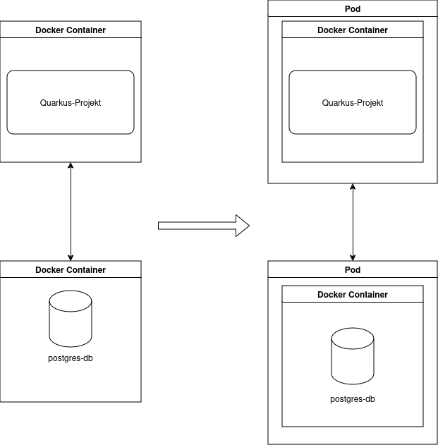

= Quarkus-Projekt in Kubernetes mit Minikube und in LeoCloud deployen
:icons: font
:toc:
:toclevels: 2

Dieses Tutorial zeigt Schritt für Schritt, wie ein Quarkus-Projekt in Kubernetes mithilfe von Docker mit Minikube und in LeoCloud deployed wird.
Optionale Schritte wie GitHub Actions sind ebenfalls erwähnt.

== Voraussetzungen
NOTE: *Installierte Software:*

- `Minikube` und `kubectl`
- Docker
- Ein GitHub-Repository für das Projekt

== Überblick

== Schritte für das Deployment in Minikube

image::images/deployment.drawio.png[Deployment in Minikube]

1. Als erstes ein Quarkus-Projekt mit einem simplen REST-Endpoint erstellen.
2. Uber-JAR erstellen.
3. Dockerfile erstellen.
4. Docker-Image erstellen und in ghcr.io (GitHub Container Registry) pushen.
5. Das Docker-Image in Minikube deployen.
6. Optional: GitHub Actions für automatisches Deployment einrichten.

== 1. Quarkus-Projekt erstellen

[source, shell]
----
mvn io.quarkus:quarkus-maven-plugin

-DprojectGroupId=com.example
-DprojectArtifactId=backend
-DclassName="com.example.GreetingResource"
-Dpath="/hello"
----

== 2. Datenbank hinzufügen

Führe folgenden Befehl aus um die Datenbank zu erstellen:

[source, shell]
----
./postgres-create-db.sh
----

Um die Datenbank zu starten führe diesen Befehl aus:

[source, shell]
----
./postgres-start.sh
----

* In den application.properties findet man den Username, das Passwort und die URL der Datenbank.

== 3. Minikube starten

IMPORTANT: Starte Minikube mit dem Befehl `minikube start`.

== 4. Uber-JAR erstellen

Nun "verpacken" wir das Projekt, um es ausführbar zu machen.

* Wir nehmen ein Uber-JAR, und kein normales JAR, sodass alle Abhängigkeiten enthalten sind.

In den application.properties fügen wir folgendes hinzu um es als Uber-JAR zu erstellen:

* application.properties befinden sich in folgendem Pfad: `minikube/src/main/resources/application.properties`

* `quarkus.package.type=uber-jar`

Erstelle nun das Uber-JAR mit dem Befehl `mvn package`.

Das Uber-JAR befindet sich im `target`-Ordner.

== 5. Dockerfile erstellen

Im Ordner `minikube/src/main/docker` erstellen wir ein Dockerfile.

[source, shell]
----
FROM eclipse-temurin:21-jre

RUN mkdir -p /opt/application
COPY *-runner.jar /opt/application/backend.jar
WORKDIR /opt/application
CMD [ "java", "-jar", "backend.jar" ]
----

Nun kopieren wir die Dockerfile-Vorlage ins `target`-Verzeichnis.

[source, shell]
----
cp src/main/docker/Dockerfile target/
----

Baue das Docker-Image mit dem Befehl `docker build --tag ghcr.io/$GITHUB_REPOSITORY/backend`.

== 6. Image zu GitHub Container Registry pushen
: *Docker-Image hochladen*

IMPORTANT: Melde dich bei der GitHub Container Registry an:

[source, shell]
----
docker login ghcr.io -u $GITHUB_ACTOR -p $GITHUB_TOKEN
----

Push das Docker-Image in die GitHub Container Registry:

[source, shell]
----
docker push ghcr.io/$GITHUB_REPOSITORY/backend
----

image::images/docker-build-command-2.png[GitHub Container Registry]

== 7. build.sh-File

* Wir erstellen dieses File um nicht alles einzeln ins Terminal eingeben zu müssen.

[source, shell]
----
mvn -B package
cp src/main/docker/Dockerfile target/
docker login ghcr.io -u $GITHUB_ACTOR -p $GITHUB_TOKEN
docker build --tag ghcr.io/$GITHUB_REPOSITORY/backend:latest ./target
docker push ghcr.io/$GITHUB_REPOSITORY/backend:latest
----

== 8. Deployment in Minikube

* Ganz oben im root-Verzeichnis befindet sich der Ordner `.github/workflows`.
* Dort erstellen wir das `build.yaml`-File.

[source, yaml]
----

name: Build and Deploy Dockerfiles
run-name: ${{ github.actor }} is building Docker images 🚀
on: [ push ]
jobs:
  build-images:
    permissions: write-all
    runs-on: ubuntu-22.04
    steps:
      - name: Check out repository code
        uses: actions/checkout@v4

      - name: Login to GitHub Container Registry
        uses: docker/login-action@v3
        with:
          registry: ghcr.io
          username: ${{ github.actor }}
          password: ${{ secrets.GITHUB_TOKEN }}

      - run: |
          pwd
          ls -lah
        working-directory: ./k8s

      - uses: actions/setup-java@v4
        with:
          distribution: 'temurin'
          java-version: '21'
          cache: 'maven'

      - name: Set up Docker Buildx
        uses: docker/setup-buildx-action@v3

      - name: Build with Maven
        run: ./build.sh
----

* Commiten, pushen und nun können wir in Github überprüfen ob das Docker-Image gebaut wurde.

== 9. Package public machen

Wir müssen das Package public machen, damit wir es in Minikube deployen können und uns viele Schritte vereinfachen können.

1. Wir klicken auf unseren User und gehen in den Tab *Packages*.
2. Dort sehen wir das erstellte Package und klicken drauf.
3. Rechts sehen wir *Package settings* und klicken drauf.
4. Dort sehen wir *Change package visibility* und klicken auf *Change visibility*.
5. Wir wählen *Public* und klicken auf *Change visibility*.

== 10. Konfiguration für das Deployment in Minikube

* Die Konfigurationsdatei befindet sich in `minikube/k8s/appsrv.yaml`.

[source, yaml]
----

# Quarkus Application Server
apiVersion: apps/v1
kind: Deployment
metadata:
  name: appsrv

spec:
  replicas: 1
  selector:
    matchLabels:
      app: appsrv
  template:
    metadata:
      labels:
        app: appsrv
    spec:
      containers:
        - name: appsrv
          image: ghcr.io/laurentmali/backend:latest #<1>
          # remove this when stable. Currently we do not take care of version numbers
          imagePullPolicy: Always
          ports:
            - containerPort: 8080
          readinessProbe:
            tcpSocket:
              port: 8080
            initialDelaySeconds: 5
            periodSeconds: 10
          livenessProbe:
            httpGet:
              path: /q/health/live
              port: 8080
            timeoutSeconds: 5
            initialDelaySeconds: 60
            periodSeconds: 120
---
apiVersion: v1
kind: Service
metadata:
  name: appsrv

spec:
  ports:
    - port: 8080
      targetPort: 8080
      protocol: TCP
  selector:
    app: appsrv
----

<1> Der Image-Name muss angepasst werden.

== 11. Deployment in Minikube

[source,shell]
----
kubectl apply -f k8s/postgres.yaml
kubectl apply -f k8s/appsrv.yaml
----

== 11.1 Minikube Dashboard zum Überprüfen

[source,shell]
----
minikube dashboard
----

== 12. Port Forwarding von Minikube

[source,shell]
----
kubectl port-forward appsrv-xxxxxx-xxxxx 8080:8080
----

== 13. In die Applikation "einloggen"

[source,shell]
----
curl http://localhost:8080/api/vehicle
----

== 14. Deployment in LeoCloud

Wir haben nun das Projekt in Minikube deployed und können es nun in LeoCloud deployen.

WARNING: Der erste Schritt ist das löschen der Config-Datei im .kube-Ordner, da diese nicht überschrieben werden kann.

image::images/Bildschirmfoto vom 2024-11-19 10-13-59.png[]

* Wende die Konfigurationsdatei `appsrv.yaml` an:

[source,shell]
----
kubectl apply -f appsrv.yaml
kubectl apply -f postgres.yaml
----

== 15. Dashboard installieren

Installiere das Kubernetes Dashboard mit dem Befehl `leocloud get template dashboard | kubectl apply -f -`.

== 16. Bearer-Token erstellen

Erstelle ein Bearer-Token mit dem Befehl `leocloud create token`, um Zugriff auf das Dashboard zu erhalten.

IMPORTANT: Speichere den generierten Token sicher, da es zur Authentifizierung später benötigt wird.

== 17. Dashboard forwarden

Richte Port-Forwarding für das Dashboard ein:

[source,shell]
----
kubectl port-forward svc/dashboard 8000:8000
----

== 18. Dashboard öffnen

Öffne das Dashboard im Browser mit der URL:

[source,shell]
----
http://localhost:8000/#/workloads?namespace=student-ifXXXXXX #<1>
----

<1> Ersetze `student-ifXXXXXX` durch deinen IF-Schulaccount.

WARNING: Meistens muss man den Link zweimal öffnen!

== 19. Dashboard entfernen

Entferne das Dashboard mit dem Befehl `leocloud delete template dashboard | kubectl delete -f -`.

== 20. Fazit

Das Kubernetes Dashboard bietet eine einfache Möglichkeit, Ressourcen und Workloads in deinem Namespace zu überwachen und zu verwalten.

