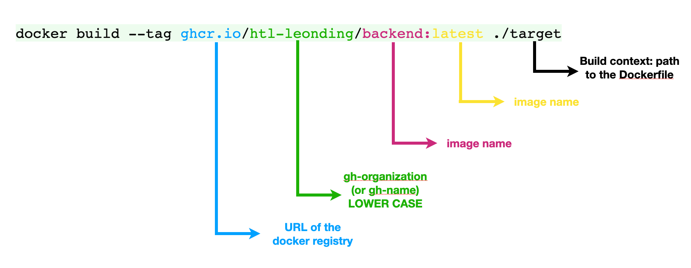
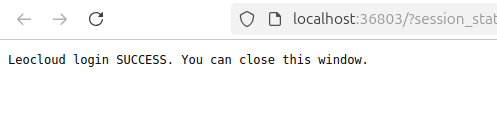

= Quarkus-Projekt in Kubernetes mit Minikube und in LeoCloud deployen
Laurent Mali
1.0, {docdate}
:icons: font
:sectnums:    // Nummerierung der Überschriften
:toc: left
:source-highlighter: rouge
:docinfo: shared

Dieses Tutorial zeigt Schritt für Schritt, wie ein Quarkus-Projekt in Kubernetes mithilfe von Docker mit Minikube und in LeoCloud deployed wird.
Optionale Schritte wie GitHub Actions sind ebenfalls erwähnt.

== Voraussetzungen
NOTE: *Installierte Software:*

- `Minikube` und `kubectl`
- Docker
- Ein GitHub-Repository für das Projekt

== Schritte für das Deployment in Minikube

1. Als Erstes ein Quarkus-Projekt mit einem simplen REST-Endpoint erstellen.
2. Uber-JAR erstellen.
3. Dockerfile erstellen.
4. Docker-Image erstellen und in ghcr.io (GitHub Container Registry) pushen.
5. Das Docker-Image in Minikube deployen.
6. Optional: GitHub Actions für automatisches Deployment einrichten.

== Quarkus-Projekt herunterladen

Lade dir das Projekt unter diesem Link herunter und builde es.

NOTE: link:/home/laurent/Dokumente/Referat/01-referate-LaurentMali/minikube-pvc.zip[Minikube-Projekt]

Entpacke das Projekt und dann kann der Spaß anfangen

== Datenbank hinzufügen

Führe folgenden Befehl aus, um die Datenbank zu erstellen:

[source, shell]
----
./postgres-create-db.sh
----

Um die Datenbank zu starten, führe diesen Befehl aus:

[source, shell]
----
./postgres-start.sh
----

* In den application.properties findet man den Username, das Passwort und die URL der Datenbank, die man für die
Datenbankanbindung benötigt.

*application.properties*
[source, shell]
----
# datasource configuration
quarkus.datasource.db-kind = postgresql
quarkus.datasource.username = demo
quarkus.datasource.password = demo
quarkus.datasource.jdbc.url = jdbc:postgresql://localhost:5432/demo
%prod.quarkus.datasource.jdbc.url = jdbc:postgresql://postgres:5432/demo

# drop and create the database at startup (use `update` to only update the schema)
quarkus.hibernate-orm.database.generation=drop-and-create

quarkus.package.jar.type=uber-jar
quarkus.hibernate-orm.sql-load-script=import.sql
----

== Minikube starten

IMPORTANT: Starte Minikube mit dem Befehl `minikube start`.

== Uber-JAR erstellen

Nun "verpacken" wir das Projekt in ein Uber-Jar, um es ausführbar zu machen.

IMPORTANT: Wir nehmen ein Uber-JAR, und kein normales JAR, sodass alle Abhängigkeiten enthalten sind.

In den application.properties fügen wir Folgendes hinzu, um es als Uber-JAR zu erstellen:

* application.properties befinden sich in folgendem Pfad: `minikube/src/main/resources/application.properties`

* `quarkus.package.type=uber-jar`

Erstelle nun das Uber-JAR mit dem Befehl `./mvnw clean package`.

Das Uber-JAR befindet sich im `target`-Ordner.

== Dockerfile erstellen

Im Ordner `minikube/src/main/docker` erstellen wir ein Dockerfile.

[source, shell]
----
FROM eclipse-temurin:21-jre

RUN mkdir -p /opt/application
COPY *-runner.jar /opt/application/backend.jar
WORKDIR /opt/application
CMD [ "java", "-jar", "backend.jar" ]
----

Nun kopieren wir die Dockerfile-Vorlage ins `target`-Verzeichnis.

[source, shell]
----
cp src/main/docker/Dockerfile target/
----

Das target-Verzeichnis sollte nach all diesen Schritten wie folgt aussehen:

== Github-Token zum Anmelden

Bevor wir das Docker-Image in die GitHub Container Registry pushen können, benötigen wir einen GitHub-Token für die Anmeldung.

IMPORTANT: Den Token aufbewahren, da dieser dann nicht mehr sichtbar ist.

Diesen kann man unter dem Pfad `Settings -> Developer settings -> Personal access tokens -> Generate new Token` erstellen.

== build.sh-File

* Wir erstellen dieses File um nicht alles einzeln ins Terminal eingeben zu müssen.

[source, shell]
----
mvn -B package
cp src/main/docker/Dockerfile target/
docker login ghcr.io -u $GITHUB_ACTOR -p $GITHUB_TOKEN
docker build --tag ghcr.io/$GITHUB_REPOSITORY/backend:latest ./target
docker push ghcr.io/$GITHUB_REPOSITORY/backend:latest
----

== Deployment in Minikube

* Ganz oben im root-Verzeichnis befindet sich der Ordner `.github/workflows`.
* Dort erstellen wir das `build.yaml`-File für die Github Actions.

[source, yaml]
----
name: Build and Deploy Dockerfiles
run-name: ${{ github.actor }} is building Docker images 🚀
on: [ push ]
jobs:
  build-images:
    permissions: write-all
    runs-on: ubuntu-22.04
    steps:
      - name: Check out repository code
        uses: actions/checkout@v4

      - name: Login to GitHub Container Registry
        uses: docker/login-action@v3
        with:
          registry: ghcr.io
          username: ${{ github.actor }}
          password: ${{ secrets.GITHUB_TOKEN }}

      - run: |
          pwd
          ls -lah
        working-directory: ./k8s

      - uses: actions/setup-java@v4
        with:
          distribution: 'temurin'
          java-version: '21'
          cache: 'maven'

      - name: Set up Docker Buildx
        uses: docker/setup-buildx-action@v3

      - name: Build with Maven
        run: ./build.sh
----

* Commiten, pushen und nun können wir in Github im Tab *Actions* überprüfen, ob das Docker-Image gebaut wurde.

== Package public machen

Wir müssen das Package public machen, damit wir es in Minikube deployen können und uns viele Schritte vereinfachen können.

1. Wir klicken auf unseren User und gehen in den Tab *Packages*.
2. Dort sehen wir das erstellte Package und klicken darauf.
3. Rechts sehen wir *Package settings* und klicken darauf.
4. Dort sehen wir *Change package visibility* und klicken auf *Change visibility*.
5. Wir wählen *Public* und klicken auf *Change visibility*.

== Konfiguration für das Deployment in Minikube

* Die Konfigurationsdatei befindet sich in `minikube/k8s/appsrv.yaml`.

[source, yaml]
----
# Quarkus Application Server
apiVersion: apps/v1
kind: Deployment
metadata:
  name: appsrv

spec:
  replicas: 1
  selector:
    matchLabels:
      app: appsrv
  template:
    metadata:
      labels:
        app: appsrv
    spec:
      containers:
        - name: appsrv
          image: ghcr.io/laurentmali/backend:latest #<1>
          # remove this when stable. Currently we do not take care of version numbers
          imagePullPolicy: Always
          ports:
            - containerPort: 8080
          readinessProbe:
            tcpSocket:
              port: 8080
            initialDelaySeconds: 5
            periodSeconds: 10
          livenessProbe:
            httpGet:
              path: /q/health/live
              port: 8080
            timeoutSeconds: 5
            initialDelaySeconds: 60
            periodSeconds: 120
---
apiVersion: v1
kind: Service
metadata:
  name: appsrv

spec:
  ports:
    - port: 8080
      targetPort: 8080
      protocol: TCP
  selector:
    app: appsrv
---
apiVersion: networking.k8s.io/v1
kind: Ingress
metadata:
  name: appsrv-ingress
  annotations:
    nginx.ingress.kubernetes.io/enable-cors: "true"
    nginx.ingress.kubernetes.io/cors-allow-methods: "PUT, GET, POST, OPTIONS, DELETE"
    # if the exposed path doesn't match backend path
    # INGRESS.kubernetes.io/rewrite-target: /
spec:
  ingressClassName: nginx
  rules:
    - host: ifXXXXXX.cloud.htl-leonding.ac.at #<2>
      http:
        paths:
          - path: /
            pathType: Prefix
            backend:
              service:
                name: appsrv
                port:
                  number: 8080
----

<1> Der Image-Name muss angepasst werden.
<2> Ersetze `ifXXXXXX` durch deinen IF-Schulaccount.

== Deployment in Minikube

[source,shell]
----
kubectl apply -f k8s/postgres.yaml
kubectl apply -f k8s/appsrv.yaml
----

=== Minikube Dashboard zum Überprüfen

[source,shell]
----
minikube dashboard
----

== Port Forwarding von Minikube

[source,shell]
----
kubectl port-forward appsrv-xxxxxx-xxxxx 8080:8080 #<1>
----

<1> Ersetze `appsrv-xxxxxx-xxxxx` durch den Namen des Pods.

IMPORTANT: Der Name des Pods kann mit dem Befehl `kubectl get pods` herausgefunden werden.

== Den Endpoint abrufen

[source,shell]
----
curl http://localhost:8080/api/vehicle
----

== Deployment in die LeoCloud

Wir haben nun das Projekt in Minikube zum Laufen gebracht und können es nun in die LeoCloud deployen.

WARNING: Der erste Schritt ist das Löschen der Config-Datei im .kube-Ordner, da diese nicht überschrieben werden kann.

image::images/Bildschirmfoto vom 2024-11-19 10-13-59.png[]

* Wende die Konfigurationsdatei `appsrv.yaml` an:

[source,shell]
----
kubectl apply -f appsrv.yaml
kubectl apply -f postgres.yaml
----

Nun müssen wir das neue Config-File erstellen und machen das mit dem Befehl `leocloud auth login`.

Hier melden wir uns mit dem IF-Schulaccount an.

== Dashboard installieren

Installiere das Kubernetes Dashboard mit dem Befehl `leocloud get template dashboard | kubectl apply -f -`.

Wenn alles erfolgreich war, sollte folgende Meldung erscheinen:

== Bearer-Token erstellen

Erstelle ein Bearer-Token mit dem Befehl `kubectl create token ifXXXXXX`, um Zugriff auf das Dashboard zu erhalten.

IMPORTANT: Speichere den generierten Token sicher, da es zur Authentifizierung später benötigt wird.

== Dashboard forwarden

Richte Port-Forwarding für das Dashboard ein:

[source,shell]
----
kubectl port-forward svc/dashboard 8000:8000
----

== Dashboard öffnen

Öffne das Dashboard im Browser mit der URL:

[source,shell]
----
http://localhost:8000/#/workloads?namespace=student-ifXXXXXX #<1>
----

<1> Ersetze `student-ifXXXXXX` durch deinen IF-Schulaccount.

WARNING: Meistens muss man den Link zweimal öffnen!

== Zugriff auf Projekt

Der Zugriff auf das Projekt erfolgt über folgende URL:

`ifXXXXXX.cloud.htl-leonding.ac.at`

IMPORTANT: Ersetze `ifXXXXXX` durch deinen IF-Schulaccount.

Nun können andere Personen über diesen Link auf das Projekt "zugreifen".

Ein Beispiel wie man auf den Endpoint gelangt sieht man im unteren Bild:

== Dashboard entfernen

Entferne das Dashboard mit dem Befehl `leocloud delete template dashboard | kubectl delete -f -`.

== Fazit

Das Kubernetes Dashboard bietet eine einfache Möglichkeit, Ressourcen und Workloads in deinem Namespace zu überwachen und zu verwalten.

